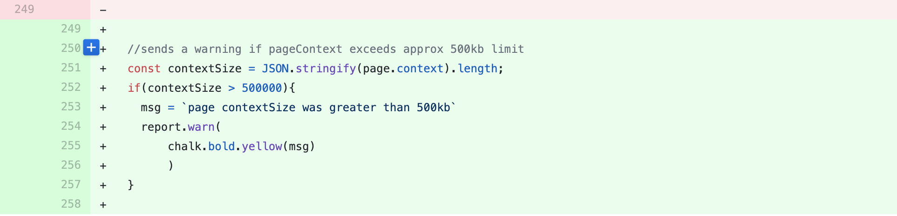
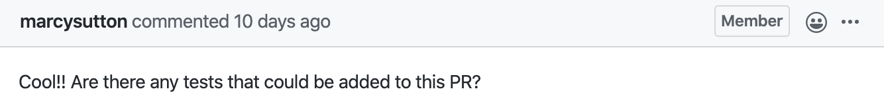
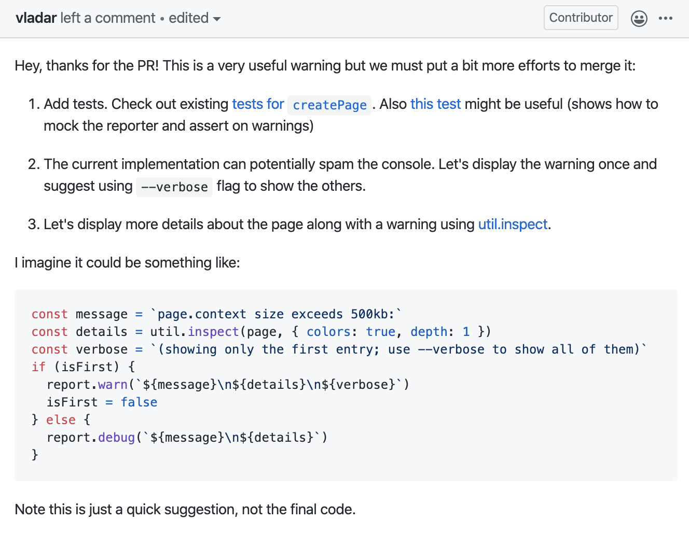
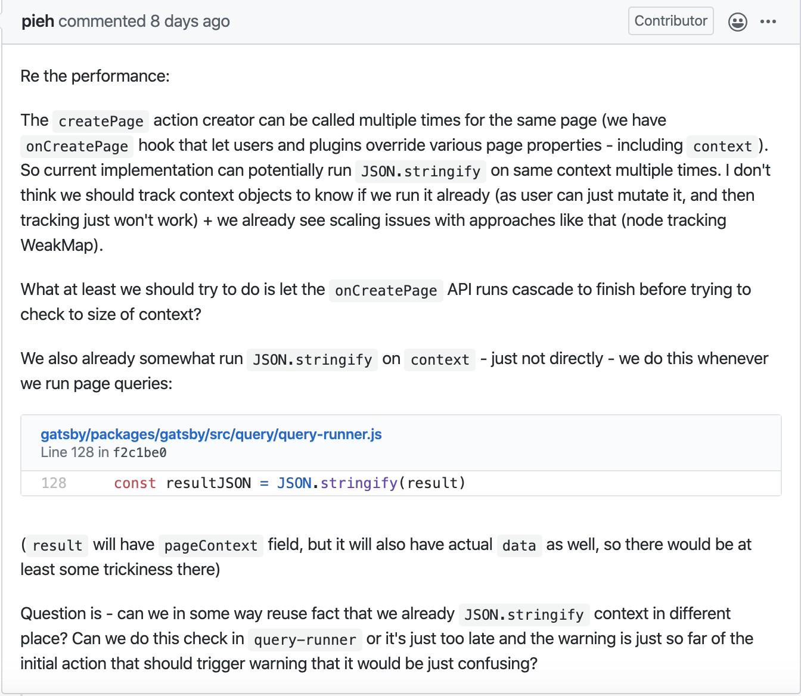
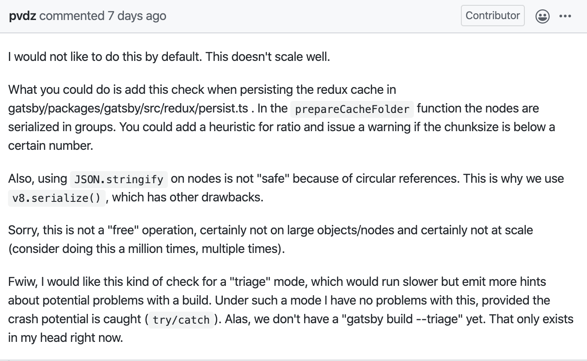
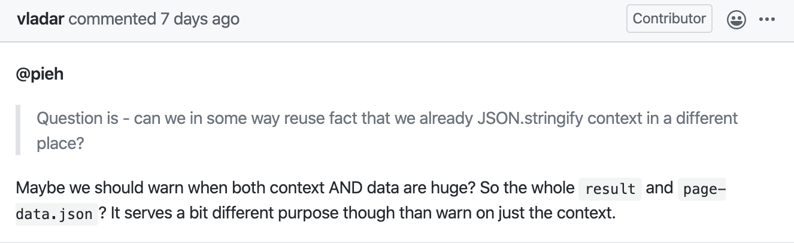
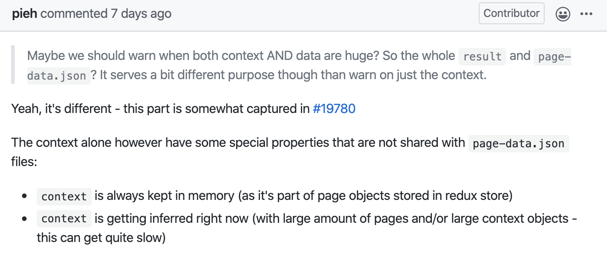

This week we talk about some of the efforts we have been making in gatsby.js

## Gatsby.js
So, we finally had submitted our pull request, and we were hoping that this would be sufficient for a simple easy feature. Then later on we'd move onto something more difficult...

But then responses came in, the first suggestion by Marcy Sutton was that there needed to be tests to check if our code was actually doing something. 

Fair enough, unit tests should definitely be encorporated.
However, more comments soon flooded in by their lead developers. 

Now... down the rabbit hole we go!
